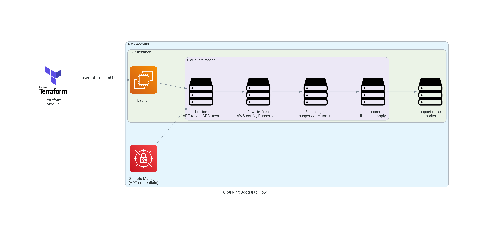

# terraform-aws-cloud-init

[](https://infrahouse.com/contact)
[](https://infrahouse.github.io/terraform-aws-cloud-init/)
[](https://registry.terraform.io/modules/infrahouse/cloud-init/aws/latest)
[](https://github.com/infrahouse/terraform-aws-cloud-init/releases/latest)
[](https://aws.amazon.com/ec2/)
[](https://github.com/infrahouse/terraform-aws-cloud-init/actions/workflows/vuln-scanner-pr.yml)
[](LICENSE)

A Terraform module that generates cloud-init userdata for EC2 instances in
a [Puppet](https://www.puppet.com/)-managed infrastructure.
This module bridges the gap between AWS instance launch and Puppet configuration by
handling essential bootstrapping tasks that must occur before Puppet can take control.

## Features

- **Puppet Integration** - Injects environment and role facts for Puppet-based configuration management
- **AWS Region Configuration** - Automatically configures AWS CLI with the instance's region
- **APT Repository Management** - Sets up InfraHouse APT repository with GPG key validation
- **Custom APT Repositories** - Support for additional repositories with optional authentication via AWS Secrets Manager
- **Package Installation** - Installs `puppet-code`, `infrahouse-toolkit`, and custom packages
- **SSH Host Keys** - Pre-configure instance SSH keys for consistent host identification
- **Custom Facts** - Inject arbitrary Puppet facts as JSON
- **Execution Hooks** - Run custom commands before (`pre_runcmd`) or after (`post_runcmd`) Puppet
- **Volume Mounts** - Configure filesystem mounts before Puppet runs
- **Gzip Compression** - Optional userdata compression for large configurations
- **Ubuntu LTS Support** - Tested with Ubuntu noble (24.04 LTS)

## Architecture



## What it does

This module creates a complete cloud-init configuration that:

- **Configures AWS tooling** - Sets up AWS CLI with the appropriate region using the instance's IAM role
- **Establishes Puppet context** - Injects environment and role facts that Puppet needs to determine configuration
- **Sets up package repositories** - Configures access to the InfraHouse APT repository for Puppet code and tooling
- **Bootstraps essential packages** - Installs `puppet-code`, `infrahouse-toolkit`, and any additional packages you specify
- **Launches Puppet** - Executes the `ih-puppet` wrapper to apply your Puppet manifests

This approach ensures your EC2 instances are properly configured from first boot, with all the context
and tooling needed for your Puppet-based infrastructure management.

Before Puppet kicks in, [Cloud-init](https://cloudinit.readthedocs.io/en/latest/index.html) pre-configures the instance.

* AWS config file `/root/.aws/config`

It is expected the instance will have an instance profile, so no AWS credentials need to be provisioned separately. 
However, the AWS tools need a default region.

* Puppet facts in `/etc/puppetlabs/facter/facts.d`

Puppet needs to know what role the instance has, and in what environment the instance runs. 
These parameters are passed as puppet facts.

* InfraHouse package repository

Tools as well as the puppet code will be installed from the infrahouse APT repository.

* Bootstrap packages

  * `puppet-code` - the puppet manifests and other code.
  * `infrahouse-toolkit` - The InfraHouse toolkit. Specifically, we need a puppet wrapper `ih-puppet`.
  * packages from the `var.packages` list.

Finally, [Cloud-init](https://cloudinit.readthedocs.io/en/latest/index.html) runs a puppet wrapper (`ih-puppet`) to apply
manifests from the `puppet-code`.

The module accepts `var.puppet_hiera_config_path` variable, should you want to use alternative hiera data. 

## Usage

The module prepares userdata:
```hcl
module "jumphost_userdata" {
  source  = "infrahouse/cloud-init/aws"
  version = "2.2.3"

  environment    = var.environment
  role           = "jumphost"
}
```
that we can later on use in a launch template or an instance config.
```hcl
resource "aws_launch_template" "jumphost" {
  name_prefix   = "jumphost-"
  instance_type = "t3a.micro"
  key_name      = var.keypair_name
  image_id      = var.ami_id == null ? data.aws_ami.ubuntu.id : var.ami_id
  iam_instance_profile {
    arn = module.jumphost_profile.instance_profile_arn
  }
  user_data = module.jumphost_userdata.userdata
}
```

## Ubuntu Version Support Policy

This module follows a **LTS-only support policy** for Ubuntu versions.

### Currently Supported Versions

- **noble (24.04 LTS)** - Supported until April 2029 (default)

### Future Support Timeline

| Period | Supported Versions | Notes |
|--------|-------------------|-------|
| **Now - April 2026** | noble (24.04) | Current LTS only |
| **April 2026 - 2029** | noble (24.04), plucky (26.04) | Both LTS versions supported |
| **April 2029+** | plucky (26.04), 28.04 LTS | noble reaches standard EOL |

### Why LTS-Only?

**Non-LTS (interim) releases are not supported** because:
- Only 9 months of support from Ubuntu (too short for production infrastructure)
- Frequent version churn creates maintenance burden
- Production systems should use LTS for stability

**Previous LTS versions (jammy, focal) are no longer supported** because:
- GPG repository signing keys have expired
- Already migrated production systems to noble
- Maintaining expired keys creates security risk

### GPG Key Lifecycle

This module validates GPG fingerprints for InfraHouse APT repositories during bootstrap.

**Current key expiration:**
- noble (24.04): Key expires **July 20, 2026**
- ⚠️ **Action Required:** noble GPG key will be rotated to 5-year lifecycle before expiration

**Future key rotation policy:**
- GPG keys will have **5-year expiration** (matching Ubuntu LTS standard support)
- New keys generated when new LTS releases
- No mid-lifecycle rotation = no production incident risk
- Users can adopt new LTS versions at their own pace

See [infrahouse/aws-control-493370826424#355](https://github.com/infrahouse/aws-control-493370826424/issues/355) for current key rotation status.

## Requirements

| Name | Version |
|------|---------|
| <a name="requirement_terraform"></a> [terraform](#requirement\_terraform) | ~> 1.5 |
| <a name="requirement_aws"></a> [aws](#requirement\_aws) | >= 5.11, < 7.0 |
| <a name="requirement_cloudinit"></a> [cloudinit](#requirement\_cloudinit) | ~> 2.3 |

## Providers

| Name | Version |
|------|---------|
| <a name="provider_aws"></a> [aws](#provider\_aws) | >= 5.11, < 7.0 |
| <a name="provider_cloudinit"></a> [cloudinit](#provider\_cloudinit) | ~> 2.3 |

## Modules

No modules.

## Resources

| Name | Type |
|------|------|
| [aws_region.current](https://registry.terraform.io/providers/hashicorp/aws/latest/docs/data-sources/region) | data source |
| [cloudinit_config.config](https://registry.terraform.io/providers/hashicorp/cloudinit/latest/docs/data-sources/config) | data source |

## Inputs

| Name | Description | Type | Default | Required |
|------|-------------|------|---------|:--------:|
| <a name="input_cancel_instance_refresh_on_error"></a> [cancel\_instance\_refresh\_on\_error](#input\_cancel\_instance\_refresh\_on\_error) | If True, ih-puppet will attempt to cancel instance refreshes on an autoscaling group, this instance is a part of. | `bool` | `false` | no |
| <a name="input_custom_facts"></a> [custom\_facts](#input\_custom\_facts) | A map of custom puppet facts | `any` | `{}` | no |
| <a name="input_environment"></a> [environment](#input\_environment) | Environment name. Passed on as a puppet fact. | `string` | n/a | yes |
| <a name="input_extra_files"></a> [extra\_files](#input\_extra\_files) | Additional files to create on an instance. | <pre>list(object({<br/>    content     = string<br/>    path        = string<br/>    permissions = string<br/>  }))</pre> | `[]` | no |
| <a name="input_extra_repos"></a> [extra\_repos](#input\_extra\_repos) | Additional APT repositories to configure on an instance. | <pre>map(<br/>    object(<br/>      {<br/>        source   = string<br/>        key      = string<br/>        machine  = optional(string)<br/>        authFrom = optional(string)<br/>        priority = optional(number)<br/>      }<br/>    )<br/>  )</pre> | `{}` | no |
| <a name="input_gzip_userdata"></a> [gzip\_userdata](#input\_gzip\_userdata) | Whether compress user data or not. | `bool` | `false` | no |
| <a name="input_mounts"></a> [mounts](#input\_mounts) | List of volumes to be mounted in the instance. One list item is a list itself with values [ fs\_spec, fs\_file, fs\_vfstype, fs\_mntops, fs-freq, fs\_passno ] | `list(list(string))` | `[]` | no |
| <a name="input_packages"></a> [packages](#input\_packages) | List of packages to install when the instances bootstraps. | `list(string)` | `[]` | no |
| <a name="input_post_runcmd"></a> [post\_runcmd](#input\_post\_runcmd) | Commands to run after runcmd | `list(string)` | `[]` | no |
| <a name="input_pre_runcmd"></a> [pre\_runcmd](#input\_pre\_runcmd) | Commands to run before runcmd | `list(string)` | `[]` | no |
| <a name="input_puppet_debug_logging"></a> [puppet\_debug\_logging](#input\_puppet\_debug\_logging) | Enable debug logging if true. | `bool` | `false` | no |
| <a name="input_puppet_environmentpath"></a> [puppet\_environmentpath](#input\_puppet\_environmentpath) | A path for directory environments. | `string` | `"{root_directory}/environments"` | no |
| <a name="input_puppet_hiera_config_path"></a> [puppet\_hiera\_config\_path](#input\_puppet\_hiera\_config\_path) | Path to hiera configuration file. | `string` | `"{root_directory}/environments/{environment}/hiera.yaml"` | no |
| <a name="input_puppet_manifest"></a> [puppet\_manifest](#input\_puppet\_manifest) | Path to puppet manifest. By default ih-puppet will apply {root\_directory}/environments/{environment}/manifests/site.pp. | `string` | `null` | no |
| <a name="input_puppet_module_path"></a> [puppet\_module\_path](#input\_puppet\_module\_path) | Path to common puppet modules. | `string` | `"{root_directory}/modules"` | no |
| <a name="input_puppet_root_directory"></a> [puppet\_root\_directory](#input\_puppet\_root\_directory) | Path where the puppet code is hosted. | `string` | `"/opt/puppet-code"` | no |
| <a name="input_role"></a> [role](#input\_role) | Puppet role. Passed on as a puppet fact. | `string` | n/a | yes |
| <a name="input_ssh_host_keys"></a> [ssh\_host\_keys](#input\_ssh\_host\_keys) | List of instance's SSH host keys.  Can be rsa, ecdsa, ed25519, etc. See https://cloudinit.readthedocs.io/en/latest/reference/examples.html#configure-instance-s-ssh-keys | <pre>list(<br/>    object(<br/>      {<br/>        type : string<br/>        private : string<br/>        public : string<br/>      }<br/>    )<br/>  )</pre> | `[]` | no |
| <a name="input_ubuntu_codename"></a> [ubuntu\_codename](#input\_ubuntu\_codename) | Ubuntu version to use for the jumphost. | `string` | `"jammy"` | no |

## Outputs

| Name | Description |
|------|-------------|
| <a name="output_userdata"></a> [userdata](#output\_userdata) | Rendered user-data with cloudinit config. |

## Contributing

We welcome contributions! Please see [CONTRIBUTING.md](CONTRIBUTING.md) for guidelines on how to submit
issues, feature requests, and pull requests.

## License

This project is licensed under the Apache 2.0 License - see the [LICENSE](LICENSE) file for details.

<!-- BEGIN_TF_DOCS -->

## Requirements

| Name | Version |
|------|---------|
| <a name="requirement_terraform"></a> [terraform](#requirement\_terraform) | ~> 1.5 |
| <a name="requirement_aws"></a> [aws](#requirement\_aws) | >= 5.11, < 7.0 |
| <a name="requirement_cloudinit"></a> [cloudinit](#requirement\_cloudinit) | ~> 2.3 |

## Providers

| Name | Version |
|------|---------|
| <a name="provider_aws"></a> [aws](#provider\_aws) | 6.28.0 |
| <a name="provider_cloudinit"></a> [cloudinit](#provider\_cloudinit) | 2.3.7 |

## Modules

No modules.

## Resources

| Name | Type |
|------|------|
| [aws_region.current](https://registry.terraform.io/providers/hashicorp/aws/latest/docs/data-sources/region) | data source |
| [cloudinit_config.config](https://registry.terraform.io/providers/hashicorp/cloudinit/latest/docs/data-sources/config) | data source |

## Inputs

| Name | Description | Type | Default | Required |
|------|-------------|------|---------|:--------:|
| <a name="input_cancel_instance_refresh_on_error"></a> [cancel\_instance\_refresh\_on\_error](#input\_cancel\_instance\_refresh\_on\_error) | If True, ih-puppet will attempt to cancel instance refreshes on an autoscaling group<br/>this instance is a part of. | `bool` | `false` | no |
| <a name="input_custom_facts"></a> [custom\_facts](#input\_custom\_facts) | A map of custom Puppet facts to inject into the instance.<br/>These facts will be written to /etc/puppetlabs/facter/facts.d/custom.json<br/>and available during Puppet runs.<br/><br/>Example:<br/>custom\_facts = {<br/>  "my\_app\_version" = "1.2.3"<br/>  "cluster\_name"   = "production"<br/>} | `any` | `{}` | no |
| <a name="input_environment"></a> [environment](#input\_environment) | Environment name. Passed on as a puppet fact.<br/>Must contain only lowercase letters, numbers, and underscores (no hyphens). | `string` | n/a | yes |
| <a name="input_extra_files"></a> [extra\_files](#input\_extra\_files) | Additional files to create on an instance via cloud-init write\_files.<br/><br/>Each file requires:<br/>- content: The file content as a string<br/>- path: Absolute path where the file will be created<br/>- permissions: File permissions in octal format (e.g., "0644", "0755")<br/><br/>Example:<br/>extra\_files = [<br/>  {<br/>    content     = "Hello World"<br/>    path        = "/etc/my-config.txt"<br/>    permissions = "0644"<br/>  }<br/>] | <pre>list(object({<br/>    content     = string<br/>    path        = string<br/>    permissions = string<br/>  }))</pre> | `[]` | no |
| <a name="input_extra_repos"></a> [extra\_repos](#input\_extra\_repos) | Additional APT repositories to configure on an instance.<br/><br/>Each repository requires:<br/>- source: APT source line (e.g., "deb [signed-by=$KEY\_FILE] https://example.com/ubuntu jammy main")<br/><br/>Key options (use ONE of the following):<br/>- key: (optional) GPG public key for the repository (PEM format)<br/>- keyid: (optional) GPG key ID or fingerprint to import from a keyserver<br/>- keyserver: (optional) Keyserver URL to fetch keyid from (default: keyserver.ubuntu.com)<br/><br/>Note: Either 'key' OR 'keyid' must be provided. If using 'keyid', you can optionally<br/>specify a custom 'keyserver'. Using 'keyid' reduces userdata size by ~3KB per repository<br/>(GPG keys are typically 3-5KB, while a keyid is ~50 bytes). This is important because<br/>AWS limits userdata to 16KB compressed, so embedded keys can quickly exhaust this limit.<br/><br/>Authentication options:<br/>- machine: (optional) Hostname for APT authentication (e.g., "apt.example.com")<br/>- authFrom: (optional) ARN of AWS Secrets Manager secret containing credentials<br/><br/>Note: machine and authFrom must be both set or both unset for authentication to work.<br/><br/>Other options:<br/>- priority: (optional) APT preference priority (1-1000)<br/><br/>Example with embedded key:<br/>extra\_repos = {<br/>  "my-repo" = {<br/>    source   = "deb [signed-by=$KEY\_FILE] https://apt.example.com/ubuntu jammy main"<br/>    key      = "-----BEGIN PGP PUBLIC KEY BLOCK-----\n...\n-----END PGP PUBLIC KEY BLOCK-----"<br/>    machine  = "apt.example.com"<br/>    authFrom = "arn:aws:secretsmanager:us-west-2:123456789012:secret:apt-credentials"<br/>    priority = 500<br/>  }<br/>}<br/><br/>Example with keyid (recommended to save userdata space):<br/>extra\_repos = {<br/>  "my-repo" = {<br/>    source    = "deb [signed-by=$KEY\_FILE] https://apt.example.com/ubuntu noble main"<br/>    keyid     = "A627B7760019BA51B903453D37A181B689AD619"<br/>    keyserver = "keyserver.ubuntu.com"  # optional, this is the default<br/>  }<br/>} | <pre>map(<br/>    object(<br/>      {<br/>        source    = string<br/>        key       = optional(string)<br/>        keyid     = optional(string)<br/>        keyserver = optional(string)<br/>        machine   = optional(string)<br/>        authFrom  = optional(string)<br/>        priority  = optional(number)<br/>      }<br/>    )<br/>  )</pre> | `{}` | no |
| <a name="input_gzip_userdata"></a> [gzip\_userdata](#input\_gzip\_userdata) | Whether to gzip compress the userdata.<br/>Enable this if userdata exceeds AWS limits (16KB compressed). | `bool` | `false` | no |
| <a name="input_mounts"></a> [mounts](#input\_mounts) | List of volumes to be mounted in the instance. One list item is a list itself with values:<br/>[ fs\_spec, fs\_file, fs\_vfstype, fs\_mntops, fs\_freq, fs\_passno ]<br/><br/>See cloud-init cc\_mounts documentation for details. | `list(list(string))` | `[]` | no |
| <a name="input_packages"></a> [packages](#input\_packages) | Additional packages to install when the instance bootstraps.<br/><br/>Note: puppet-code and infrahouse-toolkit are always installed automatically.<br/>This list is for any extra packages your instance needs. | `list(string)` | `[]` | no |
| <a name="input_post_runcmd"></a> [post\_runcmd](#input\_post\_runcmd) | Commands to run after Puppet applies the manifest.<br/><br/>Execution order:<br/>1. bootcmd (APT repo setup)<br/>2. package installation<br/>3. pre\_runcmd<br/>4. ih-puppet apply<br/>5. post\_runcmd  <-- these commands<br/>6. touch /var/run/puppet-done (completion marker)<br/><br/>Example:<br/>post\_runcmd = [<br/>  "systemctl restart myapp",<br/>  "echo 'Cloud-init complete' >> /var/log/cloud-init-output.log"<br/>] | `list(string)` | `[]` | no |
| <a name="input_pre_runcmd"></a> [pre\_runcmd](#input\_pre\_runcmd) | Commands to run before Puppet applies the manifest.<br/><br/>Execution order:<br/>1. bootcmd (APT repo setup)<br/>2. package installation<br/>3. pre\_runcmd  <-- these commands<br/>4. ih-puppet apply<br/>5. post\_runcmd<br/><br/>Example:<br/>pre\_runcmd = [<br/>  "mkdir -p /opt/myapp",<br/>  "echo 'Preparing for Puppet run' >> /var/log/cloud-init-output.log"<br/>] | `list(string)` | `[]` | no |
| <a name="input_puppet_debug_logging"></a> [puppet\_debug\_logging](#input\_puppet\_debug\_logging) | Enable debug logging for ih-puppet.<br/>When true, passes --debug flag to ih-puppet for verbose output. | `bool` | `false` | no |
| <a name="input_puppet_environmentpath"></a> [puppet\_environmentpath](#input\_puppet\_environmentpath) | A path for directory environments. | `string` | `"{root_directory}/environments"` | no |
| <a name="input_puppet_hiera_config_path"></a> [puppet\_hiera\_config\_path](#input\_puppet\_hiera\_config\_path) | Path to hiera configuration file. | `string` | `"{root_directory}/environments/{environment}/hiera.yaml"` | no |
| <a name="input_puppet_manifest"></a> [puppet\_manifest](#input\_puppet\_manifest) | Path to puppet manifest.<br/>By default ih-puppet will apply {root\_directory}/environments/{environment}/manifests/site.pp. | `string` | `null` | no |
| <a name="input_puppet_module_path"></a> [puppet\_module\_path](#input\_puppet\_module\_path) | Path to common puppet modules. | `string` | `"{root_directory}/modules"` | no |
| <a name="input_puppet_root_directory"></a> [puppet\_root\_directory](#input\_puppet\_root\_directory) | Path where the puppet code is hosted. | `string` | `"/opt/puppet-code"` | no |
| <a name="input_role"></a> [role](#input\_role) | Puppet role. Passed on as a puppet fact.<br/>Must contain only lowercase letters, numbers, and underscores (no hyphens). | `string` | n/a | yes |
| <a name="input_ssh_host_keys"></a> [ssh\_host\_keys](#input\_ssh\_host\_keys) | List of instance's SSH host keys. Can be rsa, ecdsa, ed25519, etc.<br/>See https://cloudinit.readthedocs.io/en/latest/reference/examples.html#configure-instance-s-ssh-keys | <pre>list(<br/>    object({<br/>      type    = string<br/>      private = string<br/>      public  = string<br/>    })<br/>  )</pre> | `[]` | no |
| <a name="input_ubuntu_codename"></a> [ubuntu\_codename](#input\_ubuntu\_codename) | Ubuntu version codename to use. Determines which InfraHouse repository to configure.<br/><br/>Currently supported: noble (24.04 LTS)<br/><br/>Support Policy: This module supports current Ubuntu LTS releases only.<br/>- noble (24.04) is supported until April 2029 (standard support EOL)<br/>- When plucky (26.04) releases in April 2026, both noble and plucky will be supported<br/>- Previous LTS versions (jammy, focal) are no longer supported due to expired GPG keys<br/><br/>Note: Non-LTS releases (like oracular) are not supported due to short 9-month lifecycles. | `string` | `"noble"` | no |

## Outputs

| Name | Description |
|------|-------------|
| <a name="output_userdata"></a> [userdata](#output\_userdata) | Rendered user-data with cloudinit config. |
<!-- END_TF_DOCS -->