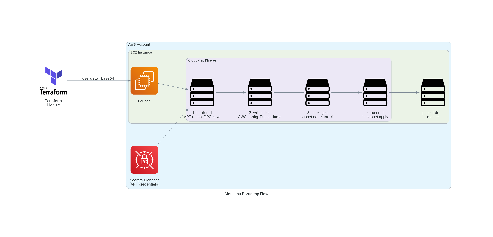

# terraform-aws-cloud-init

A Terraform module that generates cloud-init userdata for EC2 instances in a
Puppet-managed infrastructure.



## Overview

This module bridges the gap between AWS instance launch and Puppet configuration by handling
essential bootstrapping tasks that must occur before Puppet can take control. It generates a
complete cloud-init configuration that can be used in AWS launch templates or instance
configurations.

See [Architecture](architecture.md) for a walk-through of each phase in the diagram.

## Features

- **Puppet Integration** - Injects environment and role facts for Puppet-based configuration
- **AWS Region Configuration** - Automatically configures AWS CLI with the instance's region
- **APT Repository Management** - Sets up InfraHouse APT repository with GPG key validation
- **Custom APT Repositories** - Support for additional repositories with optional authentication
  via AWS Secrets Manager
- **Package Installation** - Installs `puppet-code`, `infrahouse-toolkit`, and custom packages
- **SSH Host Keys** - Pre-configure instance SSH keys for consistent host identification
- **Custom Facts** - Inject arbitrary Puppet facts as JSON
- **Execution Hooks** - Run custom commands before or after Puppet
- **Volume Mounts** - Configure filesystem mounts before Puppet runs;
  NFS/CIFS client packages are auto-installed based on `fs_vfstype`
- **Fail-closed Bootstrap** - All bootstrap steps run under
  `set -euo pipefail`; `/var/run/puppet-done` is a truthful completion
  marker, written only on the success path
- **ASG Lifecycle Integration** - Optional `lifecycle_hook_name` signals
  `CONTINUE` on success and `ABANDON` on bootstrap failure, preventing
  broken instances from joining the fleet
- **dpkg Lock Protection** - `apt-daily` timers and
  `unattended-upgrades` are stopped and masked in `bootcmd`, so they
  cannot race cloud-init or Puppet for the dpkg lock on first boot
- **Gzip Compression** - Optional userdata compression for large configurations

## Quick Start

```hcl
module "webserver_userdata" {
  source  = "registry.infrahouse.com/infrahouse/cloud-init/aws"
  version = "2.3.1"

  environment = "production"
  role        = "webserver"
}

resource "aws_launch_template" "webserver" {
  name_prefix   = "webserver-"
  instance_type = "t3.micro"
  image_id      = data.aws_ami.ubuntu.id

  iam_instance_profile {
    arn = aws_iam_instance_profile.webserver.arn
  }

  user_data = module.webserver_userdata.userdata
}
```

## Requirements

| Name | Version |
|------|---------|
| Terraform | ~> 1.5 |
| AWS Provider | >= 5.11, < 7.0 |
| cloudinit Provider | ~> 2.3 |

## Next Steps

- [Getting Started](getting-started.md) - Prerequisites and first deployment
- [Configuration](configuration.md) - Detailed variable reference
- [Architecture](architecture.md) - How the module works
- [Examples](examples.md) - Common use cases
- [Troubleshooting](troubleshooting.md) - Common issues and solutions
